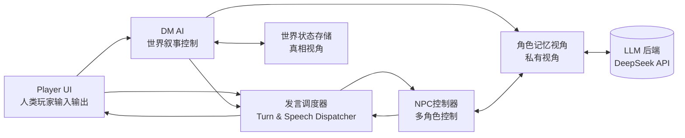

# AI DnD 项目说明文档

## 项目概述

这是一个基于大语言模型的 AI 跑团引擎 Demo，旨在创建一个沙盒式的 DnD (Dungeons & Dragons) 游戏体验。项目的核心理念是让 AI 扮演 DM (Dungeon Master) 和 NPC (Non-Player Character)，与人类玩家进行互动，自然演化出故事情节。

### 核心特性

1. **沙盒式游戏体验**：没有固定主线，故事由玩家行为、NPC 动机和 DM 合理化共同演化
2. **多智能体架构**：DM、NPC 各自独立运行，拥有不同的视角和记忆
3. **严格视角隔离**：每个角色只能看到自己应该知道的信息
4. **发言调度机制**：控制谁在什么时候发言，避免 AI 角色同时出声造成混乱

## 项目架构



## 文件结构说明

### 核心代码文件

- **`dm_engine.py`** - 主要的 DM 引擎，包含游戏核心逻辑
  - 基于 DeepSeek API 的 DM 引擎实现
  - 处理玩家输入，生成世界响应
  - 管理 NPC 和世界状态
  - 所有文本（旁白、NPC 发言）都由 AI 模型产出

- **`web_server.py`** - Flask Web 服务器
  - 提供 Web 界面入口
  - 包装 DMEngine，提供 HTTP API
  - 支持 JSON 格式的请求响应

- **`world_state_show`** - 世界状态展示文件
  - 包含当前游戏世界的完整状态
  - NPC 档案、位置信息、玩家信息
  - 以 JSON 格式存储世界真相

### 配置文件

- **`pyproject.toml`** - Python 项目配置
  - 项目依赖：Flask、requests
  - 要求 Python 3.9+

- **`requirements.txt`** - 依赖包列表
- **`uv.lock`** - 依赖锁定文件
- **`todo`** - 项目待办事项和架构设计文档

### 故事数据

- **`stories/`** - 故事数据目录
  - `emberlight_demo_v1/` - 灰烬灯节演示故事
    - `story_seed.json` - 故事设定和初始状态
    - `pc_seren_arclight.json` - 玩家角色设定
    - `20251120_080251/` 等 - 对话会话记录
      - `logs/` - 详细的 AI 调用日志
        - `dm/main/` - DM 日志
        - `npc/` - NPC 日志
      - `npcs/` - NPC 状态存档

### Web 客户端

- **`web_client/`** - 前端文件
  - `index.html` - Web 界面

### 其他文件

- **`model_test.sh`** - 模型测试脚本
- **`README.md`** - 项目自述文件（当前为空）
- **`__pycache__/`** - Python 字节码缓存
- **`old_data/`** - 历史数据存档

## 核心模块功能

### 1. 世界状态存储 (World State)

- **功能**：维护游戏世界的"上帝视角"真相
- **内容**：
  - 时间、地点、天气
  - 所有角色的真实位置和状态
  - 重要事件记录
  - NPC 档案和关键信息

### 2. DM AI (Dungeon Master)

- **职责**：
  - 解析玩家输入的意图
  - 更新世界状态
  - 生成环境描述和旁白
  - 决定哪些 NPC 应该发言
  - 维护故事的因果逻辑

### 3. NPC 控制器 (Agent Controller)

- **功能**：
  - 为每个 NPC 生成符合人设的对话
  - 基于角色的私有记忆和动机
  - 执行 DM 分配的任务指令

### 4. 发言调度器 (Speech Dispatcher)

- **目标**：控制对话节奏，避免 AI 角色混乱发言
- **机制**：
  - 计算每个角色的发言分数
  - 决定必须发言和可选发言的角色
  - 控制每轮发言的数量

### 5. 视角隔离机制

- **原理**：每个 AI 角色只能访问自己应该知道的信息
- **实现**：
  - 私有记忆系统
  - 信息过滤机制
  - 独立的 prompt 构建

## 当前演示故事：灰烬灯节

### 背景设定

- **地点**：余烬村（北境山麓的偏远山村）
- **事件**：灰烬灯节前夜，准备重要的传统仪式
- **玩家角色**：赛伦·弧光，星辉学院派出的奥术师

### 主要 NPC

1. **奥尔德·灰杉** - 村长，知道古老传说的秘密
2. **米拉·哈特** - 矮人铁匠，负责锻造仪式用的日耀钢灯芯
3. **阿拉里克·温德** - 牧师，主导仪式的精神层面
4. **奈娅·迅枝** - 斥候，发现了可疑痕迹
5. **哈兰·罗谢** - 商人，实际的幕后黑手（盗取日耀钢）

### 核心冲突

- 仪式关键材料"日耀钢"被盗
- 村民担心仪式失败会导致古老邪恶苏醒
- 玩家需要调查真相，确保仪式顺利进行

## 技术栈

- **后端**：Python + Flask
- **AI 模型**：DeepSeek API (V3.1 和 R1)
- **前端**：原生 HTML/JavaScript
- **数据存储**：JSON 文件
- **日志系统**：结构化的 JSON 日志文件

## 运行方式

1. **安装依赖**：
   ```bash
   pip install -r requirements.txt
   ```

2. **启动 Web 服务器**：
   ```bash
   python web_server.py
   ```

3. **访问游戏界面**：浏览器打开对应端口的 Web 界面

## 开发状态与待优化项

### 当前问题

1. 前端体验需要优化（支持语音输入、TTS、流式输出）
2. 旁白输出体验不佳
3. 返回文字过多，影响体验
4. 世界状态管理需要重构为类实例
5. NPC 创造和加载逻辑需要优化

### 计划改进

1. 优化 prompt 设计
2. 实现专门的世界状态管理 AI
3. 改进对话机制和状态管理
4. 增加语音交互功能
5. 优化前端交互体验

## 设计理念

### 核心原则

1. **叙事优先**：重点在于故事体验，战斗系统是后续考虑
2. **自然演化**：不预设固定结局，让故事自然发展
3. **智能体独立**：每个 AI 角色都有独立的认知和记忆
4. **合理性维护**：DM 确保世界的逻辑一致性

### 创新点

- 严格的视角隔离实现真正的"信息不对称"
- 发言调度机制避免 AI 角色混乱对话
- 沙盒式设计允许玩家行为完全改变故事走向
- 多层次的记忆和状态管理

这个项目展示了 AI 在互动叙事和角色扮演游戏中的潜力，为未来的 AI 驱动游戏提供了有价值的探索方向。
